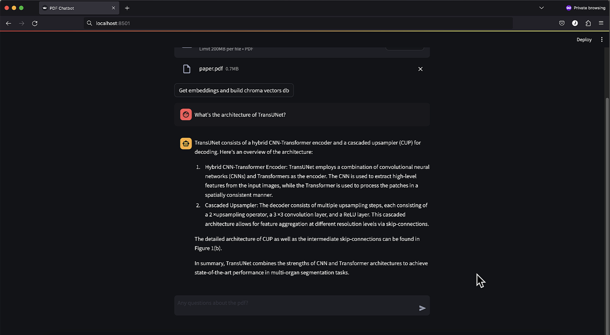

# PDFchatbot: Chat with your PDFs.

## Description
This project is a PDF chatbot that utilizes the Llama2 language model 7B model to provide answers to questions about a given PDF file. 
The chatbot extracts pages from the PDF, builds a question-answer chain using the LLM, and generates responses based on user input.

## Installation
- Download and install Ollama: 'https://ollama.ai/download'
- Clone the repository: 'https://github.com/JaouadT/pdfchatbot_llama2_langchain.git'.
- cd into the repository: 'cd dfchatbot_llama2_langchain'.
- pip install -r requirements.txt

## Usage
- Run the script: 'python main.py --pdf_file 'pdfs/paper.pdf'
- Or run the streamlit app: 'streamlit run app.py'

